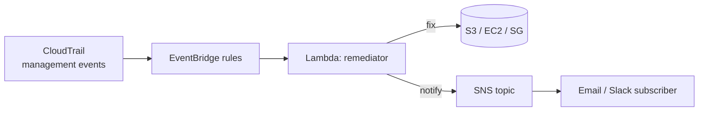
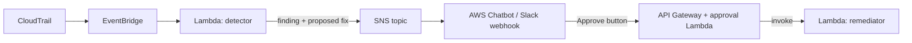

# AWS Auto-Remediation


A serverless, Terraform-defined system that watches CloudTrail for common AWS
misconfigurations and fixes them automatically, in seconds — before they sit
exposed waiting for a scheduled scan to find them.

## Problem

Periodic compliance scanners (AWS Config rules, scheduled scripts, manual
audits) close the loop on misconfigurations hours or days after they happen.
A bucket made public at 2am can sit open all night. This project closes that
loop in near-real-time: every relevant CloudTrail event is evaluated and, if
it represents a misconfiguration, remediated by a Lambda function within
seconds of the event landing on EventBridge.

It currently detects and remediates:

| Finding | Trigger | Remediation |
|---|---|---|
| S3 bucket made public | `PutBucketAcl`, `PutBucketPolicy`, `PutPublicAccessBlock` | Reset the ACL to private and re-apply full S3 Block Public Access |
| Security group open to the world on a sensitive port | `AuthorizeSecurityGroupIngress` | Revoke the offending `0.0.0.0/0` / `::/0` ingress rule |
| Unencrypted EBS volume created | `CreateVolume` | Tag the volume `ComplianceStatus=NON_COMPLIANT_UNENCRYPTED` and alert (volumes can't be encrypted in place after creation) |

Every action — taken or skipped — is published to an SNS topic, so the system
is auditable: you can always answer "what did this thing do and why?"

## Architecture



EventBridge rules match CloudTrail's "AWS API Call via CloudTrail" events
directly on the default event bus — no CloudTrail trail needs to be created
for this to work, since management events are delivered to EventBridge
automatically.

## Repository layout

```
terraform/   EventBridge rules, Lambda, IAM role, SNS topic, KMS key
src/         Lambda source: handler.py dispatches to one module per finding
tests/       pytest + moto unit tests, one module to one test file
.github/     CI workflow: terraform fmt/validate, checkov, pytest
```

## Dry run mode

Set `dry_run = true` (the Terraform default) and the Lambda will log and
publish to SNS exactly what it *would* change, without calling any mutating
AWS API. Flip it to `false` to let it actually remediate:

```hcl
# terraform/terraform.tfvars (not committed)
dry_run = false
```

## Live demo

This assumes you've already run `terraform apply` (see below) with
`create_demo_bucket = true` and `dry_run = false`.

1. **Deploy the stack** (creates a private demo bucket you can safely break):

   ```bash
   cd terraform
   terraform init
   terraform apply -var="dry_run=false" -var="create_demo_bucket=true"
   ```

2. **Make the demo bucket public:**

   ```bash
   BUCKET=$(terraform output -raw demo_bucket_name)
   aws s3api put-bucket-acl --bucket "$BUCKET" --acl public-read
   ```

3. **Watch it get locked back down.** Within a few seconds:

   ```bash
   aws s3api get-bucket-acl --bucket "$BUCKET"
   aws s3api get-public-access-block --bucket "$BUCKET"
   ```

   The ACL is back to private and `BlockPublicAcls` etc. are all `true`
   again — tail the Lambda's logs to watch it happen live:

   ```bash
   aws logs tail "$(terraform output -raw log_group_name)" --follow
   ```

4. **Check your inbox / the SNS topic** for the remediation notification (if
   you set `notification_email`).

You can run the same play against a security group (`authorize-security-group-ingress`
with `0.0.0.0/0` on port 22) or `ec2 create-volume` without `--encrypted` to
see the other two remediations fire.

## Teardown

```bash
cd terraform
terraform destroy
```

This removes everything, including the demo bucket if you created one. No
state or resources are left behind.

## Cost

Entirely serverless: EventBridge rules, a Lambda invoked only on matching
events, an SNS topic, and a KMS key. At lab/demo scale (a handful of
invocations) this runs at **~$0/month** — you're inside the AWS free tier for
Lambda invocations and EventBridge events, and SNS/KMS costs are fractions of
a cent per use.

## Measurable impact

Cuts the exposure window for these three misconfiguration classes from
whatever your next scheduled compliance scan would have been (commonly
hours, often a full day) down to **single-digit seconds** from misconfiguration
to remediation.

## Extension: human-in-the-loop approval

For environments where auto-remediation is too aggressive (e.g. you want a
human to confirm before revoking a security group rule in production), the
SNS topic can fan out to a Slack approval workflow instead of triggering the
fix directly:



In this variant, the existing remediator Lambda is split into a **detector**
(finds the issue, posts a "Found X — approve fix?" message to Slack via SNS
+ AWS Chatbot or a custom webhook) and the existing remediation modules,
invoked only after a Slack user clicks "Approve" (handled by an API Gateway
endpoint backed by a small approval Lambda that validates the Slack signature
and then calls the remediation module directly). This trades remediation
speed for an explicit human checkpoint — useful for higher-blast-radius
actions while keeping the codebase identical, since the remediation modules
themselves don't change.

## Testing

```bash
pip install -r requirements-dev.txt
pytest -v
```

Tests use [moto](https://github.com/getmoto/moto) to mock AWS — no real AWS
account or credentials are touched. Each remediation module is tested for:
a violating resource gets fixed, a compliant resource is a no-op, and
`dry_run=True` makes no mutating calls.

## CI

GitHub Actions runs on every push/PR:

- `terraform fmt -check` and `terraform validate`
- [checkov](https://www.checkov.io/) security scan against `terraform/`
- `pytest` (with moto) against `src/`

`terraform apply` never runs in CI.
